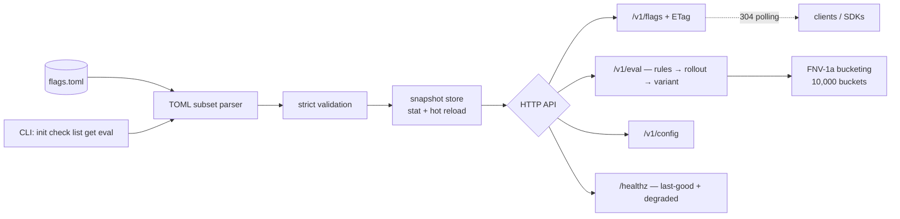

# flagstead

[English](README.md) | [中文](README.zh.md) | [日本語](README.ja.md)

[](LICENSE) [](go.mod) [](CHANGELOG.md)  [](CONTRIBUTING.md)

**flagstead：オープンソースのシングルバイナリなフィーチャーフラグ＆リモート設定サーバー。バックエンドは git と相性の良い TOML ファイル 1 つだけ——データベースもダッシュボードもなく、スティッキーなパーセントロールアウトと ETag ポーリングだけ。**


```bash
git clone https://github.com/JaydenCJ/flagstead && cd flagstead
go build -o flagstead ./cmd/flagstead    # single static binary, stdlib only
```

> プレリリース：v0.1.0 はまだパッケージレジストリに公開されていません。上記の手順でソースからビルドしてください（Go ≥1.22 なら可）。

## なぜ flagstead？

フィーチャーフラグはいつの間にか「大家付きのインフラ」になりました。LaunchDarkly は席数課金で、あなたのキルスイッチを握っています。Unleash や Flipt はセルフホストできても、データベース・ダッシュボード・管理 API が付いてきて、ブール値 1 つ切り替えるために運用・バックアップ・監査の対象が 3 つ増えます。一方、ほとんどのフラグシステムの実体は数 KB の設定に過ぎず、チームがあらゆる設定変更で既に信頼しているツール——git——にこそ収まるべきものです。flagstead はこの観察を真剣に受け止めました。フラグは 1 つの TOML ファイルに住み——pull request でレビューされ、diff され、blame され、`git revert` でロールバックでき——ゼロ依存のバイナリ 1 つが強い ETag（ファイルが変わるまでポーリングはボディなしの 304 で済む）、決定的でスティッキーなパーセントロールアウト、ターゲティングルール、重み付き A/B バリアント、リモート設定ツリーを HTTP で提供します。ファイルを編集すれば即ホットリロード。壊しても最後の正常スナップショットを配信し続け、`/healthz` が直すべき箇所を教えてくれます。

| | flagstead | LaunchDarkly | Unleash | Flipt |
|---|---|---|---|---|
| ストレージ | TOML ファイル 1 つ | 先方のクラウド | Postgres | データベース（SQLite/Postgres/…） |
| フラグ変更を git diff でレビュー | ✅ ネイティブ | ❌ | ❌ | 部分的（宣言的バックエンド） |
| セルフホストの手間 | バイナリ 1 つ、数秒 | ❌ SaaS | サーバー + DB + UI | サーバー + DB |
| スティッキーなパーセントロールアウト | ✅ | ✅ | ✅ | ✅ |
| HTTP キャッシュ（ETag / 304 ポーリング） | ✅ 全エンドポイント、ユーザー別評価まで | ストリーミング SDK | ✅ クライアント API | ❌ |
| 設定を壊しても落ちない | ✅ 最終正常スナップショット | n/a | n/a | n/a |
| 価格 | 無料、MIT | 席数課金 | オープンコア | 無料 |
| ランタイム依存 | 0 | n/a | 多数 | 複数 |

<sub>依存数は 2026-07-13 に確認：flagstead が import するのは Go 標準ライブラリのみ——TOML パーサーさえ内蔵です。</sub>

## 特徴

- **ファイル 1 つがデータベースのすべて** —— フラグ・ルール・バリアント・リモート設定が 1 つの TOML に収まり、`git diff` で説明でき `git revert` で戻せる。
- **スティッキーなパーセントロールアウト** —— FNV-1a で 10,000 バケットへ写像（ベーシスポイント精度、フラグごとのソルト）；25% → 50% に上げても有効済みのキーは絶対に外れない。
- **13 演算子のターゲティングルール** —— eq/ne、in/not_in、contains、prefix/suffix、数値の gt/gte/lt/lte、exists/not_exists；先勝ちで、属性欠落時は安全側に倒れて不一致。
- **A/B テスト用の重み付きバリアント** —— キーごとに決定的に割り当て。ロールアウトのゲートとは独立のハッシュなので母集団が相関しない。
- **コストゼロの ETag ポーリング** —— 全エンドポイントがファイルの SHA-256 由来の強い ETag を持ち、クライアントは `If-None-Match` で再検証、変更がなければボディなしの 304 だけ。
- **壊れないリロード** —— リクエストごとに mtime/size を stat して変更検出（ウォッチャー不要）；壊れた編集でも最終正常スナップショットを配信し続け、修正まで `/healthz` に表示。
- **厳格なバリデーションと正直なエラー** —— `flagstead check` は全問題をファイルパスと行番号付きで一度に報告；`enbled` のような未知キーはハードエラーで、黙って無視しない。

## クイックスタート

```bash
./flagstead init            # writes a commented starter flags.toml
./flagstead serve &         # http://127.0.0.1:4949, loopback by default
curl -s http://127.0.0.1:4949/v1/eval/new-checkout?key=user-2
```

実際にキャプチャした出力：

```text
{
  "flag": "new-checkout",
  "key": "user-2",
  "enabled": true,
  "reason": "rollout",
  "rule_index": -1,
  "bucket": 2040
}
```

同じ評価は CLI でオフラインでも実行でき、ルールの判定が見えます（実際の出力）：

```text
$ flagstead eval new-checkout --key user-42 --attr country=JP
flag     new-checkout
key      user-42
enabled  true
reason   rule
rule     0
```

ポーリングは条件付き GET 1 回です（実際の出力）：

```text
$ curl -sI http://127.0.0.1:4949/v1/flags | grep -iE 'etag|cache'
Cache-Control: no-cache
Etag: "88bde7d03e8c848bfac95828279d3098"
$ curl -s -o /dev/null -w '%{http_code}\n' -H 'If-None-Match: "88bde7d03e8c848bfac95828279d3098"' http://127.0.0.1:4949/v1/flags
304
```

## フラグファイル

完全なリファレンス（ルール、バリアント、バケット計算、TOML サブセット）は [docs/file-format.md](docs/file-format.md)、実践的な例は [examples/flags.toml](examples/flags.toml) にあります。

| キー | デフォルト | 効果 |
|---|---|---|
| `flags.<name>.enabled` | *必須* | マスタースイッチ；`false` は例外なく全員オフ |
| `flags.<name>.rollout` | `100` | 有効化するキーの割合、0–100、ベーシスポイント精度 |
| `flags.<name>.salt` | フラグ名 | バケットのソルト——変えれば再バケット、共有すれば同一バケット |
| `flags.<name>.rules` | — | テーブル配列；最初に一致したルールが判定 |
| `flags.<name>.variants` | — | 重み付きアーム、キーごとに決定的に選択 |
| `config.*` | — | 自由構造のツリー、`/v1/config[/path]` で提供 |

## HTTP API

| エンドポイント | メソッド | 返すもの |
|---|---|---|
| `/v1/flags` | GET | 全フラグ定義 + ファイルハッシュ、強い ETag |
| `/v1/flags/{name}` | GET | フラグ定義 1 件、ETag 付き |
| `/v1/eval/{name}?key=K&attr.country=JP` | GET | reason/bucket 付きの評価結果、ETag 付き |
| `/v1/eval` | POST | `{"key":…,"attributes":…,"flags":[…]}` の一括評価 |
| `/v1/config` と `/v1/config/{path}` | GET | リモート設定ツリーまたは値 1 つ、ETag 付き |
| `/healthz` | GET | `ok`、またはファイル破損中は `degraded` + パースエラー |

## 検証

このリポジトリは CI を同梱しません。上記の主張はすべてローカル実行で検証されます：

```bash
go test ./...            # 85 deterministic tests, offline, < 5 s
bash scripts/smoke.sh    # builds, serves on a loopback port, prints SMOKE OK
```

## アーキテクチャ



## ロードマップ

- [x] v0.1.0 —— 厳格バリデーション付き TOML フラグファイル、スティッキーなパーセントロールアウト、13 演算子のルール、重み付きバリアント、ETag ポーリング API、最終正常スナップショットで守るホットリロード、CLI（init/check/list/get/eval/serve）、85 テスト + smoke スクリプト
- [ ] `flagstead diff old.toml new.toml` —— PR レビュー向けの「誰がこのフラグを得る/失うか」レポート
- [ ] ロングポーリングモード（`?wait=30s`）で高頻度ポーリングなしに変更を受信
- [ ] スナップショット署名（分離署名ファイル）でサプライチェーンに敏感なデプロイに対応
- [ ] ポーリングループとローカル評価を包む小さなクライアント SDK（Go、TypeScript）
- [ ] チームごとのフラグ所有権を持つモノレポ向けのマルチファイル include

全リストは [open issues](https://github.com/JaydenCJ/flagstead/issues) を参照してください。

## コントリビュート

Issue・ディスカッション・pull request を歓迎します——ローカルのワークフロー（gofmt、vet、テスト、`SMOKE OK`）は [CONTRIBUTING.md](CONTRIBUTING.md) を参照。入門タスクは [good first issue](https://github.com/JaydenCJ/flagstead/issues?q=is%3Aissue+is%3Aopen+label%3A%22good+first+issue%22) のラベル付き、設計の議論は [Discussions](https://github.com/JaydenCJ/flagstead/discussions) で。

## ライセンス

[MIT](LICENSE)
