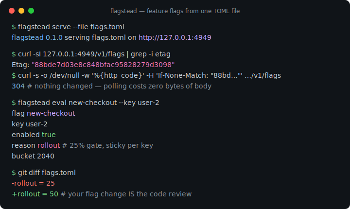
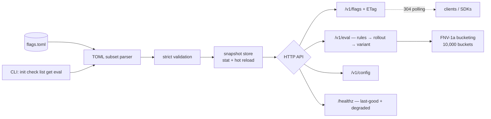

# flagstead

[English](README.md) | [中文](README.zh.md) | [日本語](README.ja.md)

[](LICENSE) [](go.mod) [](CHANGELOG.md)  [](CONTRIBUTING.md)

**flagstead：an open-source, single-binary feature-flag and remote-config server backed by one git-friendly TOML file — no database, no dashboard, just sticky percent rollouts and ETag polling.**



```bash
git clone https://github.com/JaydenCJ/flagstead && cd flagstead
go build -o flagstead ./cmd/flagstead    # single static binary, stdlib only
```

> Pre-release: v0.1.0 is not tagged on a package registry yet; build from source as above (any Go ≥1.22).

## Why flagstead?

Feature flags have quietly become infrastructure with a landlord. LaunchDarkly bills per seat and owns your kill switches; Unleash and Flipt are self-hostable but arrive with a database, a dashboard, and an admin API — three more things to run, back up, and audit before you can flip one boolean. Meanwhile the actual content of most flag systems is a few kilobytes of configuration that would fit beautifully in the tool your team already trusts for every other config change: git. flagstead takes that observation seriously. Flags live in one TOML file — reviewed in pull requests, diffed, blamed, reverted, rolled back by `git revert` — and a single zero-dependency binary serves them over HTTP with strong ETags (pollers pay a bodyless 304 until the file actually changes), deterministic sticky percent rollouts, targeting rules, weighted A/B variants, and a remote-config tree. Edit the file and the server hot-reloads; break the file and it keeps serving the last good snapshot while `/healthz` tells you what to fix.

| | flagstead | LaunchDarkly | Unleash | Flipt |
|---|---|---|---|---|
| Storage | one TOML file | their cloud | Postgres | database (SQLite/Postgres/…) |
| Flag changes reviewed as git diffs | ✅ native | ❌ | ❌ | partial (declarative backend) |
| Self-host effort | one binary, seconds | ❌ SaaS | server + DB + UI | server + DB |
| Sticky percent rollouts | ✅ | ✅ | ✅ | ✅ |
| HTTP caching (ETag / 304 polling) | ✅ every endpoint, even per-user eval | streaming SDKs | ✅ client API | ❌ |
| Survives a bad config edit | ✅ last-good snapshot | n/a | n/a | n/a |
| Price | free, MIT | per-seat billing | open core | free |
| Runtime dependencies | 0 | n/a | many | several |

<sub>Dependency counts checked 2026-07-13: flagstead imports the Go standard library only — even the TOML parser is built in.</sub>

## Features

- **One file is the whole database** — flags, rules, variants and remote config in a single TOML file that `git diff` explains and `git revert` rolls back.
- **Sticky percent rollouts** — FNV-1a bucketing over 10,000 buckets (basis-point precision, per-flag salt); raising 25% → 50% never kicks out a key that was already enabled.
- **Targeting rules, 13 operators** — eq/ne, in/not_in, contains, prefix/suffix, numeric gt/gte/lt/lte, exists/not_exists; first match wins, missing attributes fail closed.
- **Weighted variants for A/B tests** — deterministic per-key arm assignment, hashed independently of the rollout gate so populations don't correlate.
- **ETag polling that costs nothing** — every endpoint carries a strong ETag from the file's SHA-256; clients revalidate with `If-None-Match` and get a bodyless 304 until the file changes.
- **Unbreakable reloads** — edits are picked up per request (mtime/size stat, no watchers); a broken edit keeps the last good snapshot serving and surfaces on `/healthz` until fixed.
- **Strict validation, honest errors** — `flagstead check` reports every problem at once with the file path and line number; unknown keys like `enbled` are hard errors, not silent no-ops.

## Quickstart

```bash
./flagstead init            # writes a commented starter flags.toml
./flagstead serve &         # http://127.0.0.1:4949, loopback by default
curl -s http://127.0.0.1:4949/v1/eval/new-checkout?key=user-2
```

Real captured output:

```text
{
  "flag": "new-checkout",
  "key": "user-2",
  "enabled": true,
  "reason": "rollout",
  "rule_index": -1,
  "bucket": 2040
}
```

The same evaluation works offline from the CLI, with rules visibly deciding (real output):

```text
$ flagstead eval new-checkout --key user-42 --attr country=JP
flag     new-checkout
key      user-42
enabled  true
reason   rule
rule     0
```

And polling is one conditional GET (real output):

```text
$ curl -sI http://127.0.0.1:4949/v1/flags | grep -iE 'etag|cache'
Cache-Control: no-cache
Etag: "88bde7d03e8c848bfac95828279d3098"
$ curl -s -o /dev/null -w '%{http_code}\n' -H 'If-None-Match: "88bde7d03e8c848bfac95828279d3098"' http://127.0.0.1:4949/v1/flags
304
```

## The flag file

Full reference (rules, variants, bucketing math, TOML subset) in [docs/file-format.md](docs/file-format.md); a realistic example lives in [examples/flags.toml](examples/flags.toml).

| Key | Default | Effect |
|---|---|---|
| `flags.<name>.enabled` | *required* | master switch; `false` is off for everyone, no exceptions |
| `flags.<name>.rollout` | `100` | percent of keys enabled, 0–100, basis-point precision |
| `flags.<name>.salt` | flag name | bucketing salt — change it to re-bucket, share it to co-bucket |
| `flags.<name>.rules` | — | array of tables; first matching rule decides |
| `flags.<name>.variants` | — | weighted arms, picked deterministically per key |
| `config.*` | — | free-form tree served at `/v1/config[/path]` |

## HTTP API

| Endpoint | Method | Returns |
|---|---|---|
| `/v1/flags` | GET | all flag definitions + file hash, strong ETag |
| `/v1/flags/{name}` | GET | one flag definition, ETag |
| `/v1/eval/{name}?key=K&attr.country=JP` | GET | evaluation result with reason/bucket, ETag |
| `/v1/eval` | POST | batch evaluation for `{"key":…,"attributes":…,"flags":[…]}` |
| `/v1/config` and `/v1/config/{path}` | GET | remote-config tree or one value, ETag |
| `/healthz` | GET | `ok` or `degraded` + parse error while the file is broken |

## Verification

This repository ships no CI; every claim above is verified by local runs:

```bash
go test ./...            # 85 deterministic tests, offline, < 5 s
bash scripts/smoke.sh    # builds, serves on a loopback port, prints SMOKE OK
```

## Architecture



## Roadmap

- [x] v0.1.0 — TOML flag file with strict validation, sticky percent rollouts, 13-operator rules, weighted variants, ETag polling API, hot reload with last-good safety net, CLI (init/check/list/get/eval/serve), 85 tests + smoke script
- [ ] `flagstead diff old.toml new.toml` — human-readable "who gains/loses this flag" report for PR reviews
- [ ] Long-poll mode (`?wait=30s`) so clients get changes without tight polling loops
- [ ] Signed snapshots (detached signature file) for supply-chain-sensitive deployments
- [ ] Tiny client SDKs (Go, TypeScript) wrapping the polling loop and local evaluation
- [ ] Multi-file includes for monorepos with per-team flag ownership

See the [open issues](https://github.com/JaydenCJ/flagstead/issues) for the full list.

## Contributing

Issues, discussions and pull requests are welcome — see [CONTRIBUTING.md](CONTRIBUTING.md) for the local workflow (gofmt, vet, tests, `SMOKE OK`). Good entry points are labelled [good first issue](https://github.com/JaydenCJ/flagstead/issues?q=is%3Aissue+is%3Aopen+label%3A%22good+first+issue%22), and design questions live in [Discussions](https://github.com/JaydenCJ/flagstead/discussions).

## License

[MIT](LICENSE)
