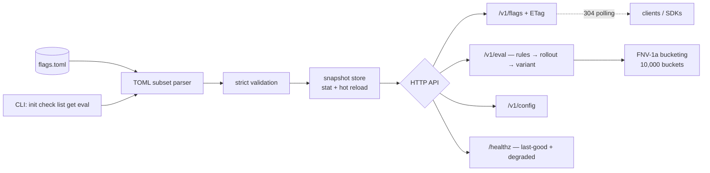

# flagstead

[English](README.md) | [中文](README.zh.md) | [日本語](README.ja.md)

[](LICENSE) [](go.mod) [](CHANGELOG.md)  [](CONTRIBUTING.md)

**flagstead：开源的单二进制特性开关（feature flag）与远程配置服务器，后端只有一个 git 友好的 TOML 文件——没有数据库、没有控制台，只有粘性百分比灰度和 ETag 轮询。**


```bash
git clone https://github.com/JaydenCJ/flagstead && cd flagstead
go build -o flagstead ./cmd/flagstead    # single static binary, stdlib only
```

> 预发布：v0.1.0 尚未发布到任何包仓库；请按上述方式从源码构建（Go ≥1.22 即可）。

## 为什么选 flagstead？

特性开关不知不觉变成了「有房东的基础设施」。LaunchDarkly 按席位收费，还握着你的紧急开关；Unleash 和 Flipt 虽可自托管，却自带数据库、控制台和管理 API——想翻转一个布尔值，得先多运维、多备份、多审计三样东西。而多数开关系统的实际内容不过几 KB 配置，本可以放进你的团队早已信赖的那个配置变更工具里：git。flagstead 认真对待这个观察。开关全部住在一个 TOML 文件里——在 pull request 中评审、diff、blame、回退、用 `git revert` 一键回滚——由一个零依赖的二进制通过 HTTP 提供服务：强 ETag（文件不变时轮询只花一个无 body 的 304）、确定性的粘性百分比灰度、定向规则、加权 A/B 变体，以及一棵远程配置树。改文件即热加载；改坏了也照常服务最后一份正确快照，同时 `/healthz` 告诉你该修什么。

| | flagstead | LaunchDarkly | Unleash | Flipt |
|---|---|---|---|---|
| 存储 | 一个 TOML 文件 | 他们的云 | Postgres | 数据库（SQLite/Postgres/…） |
| 开关变更以 git diff 评审 | ✅ 原生 | ❌ | ❌ | 部分（声明式后端） |
| 自托管成本 | 一个二进制，几秒 | ❌ SaaS | 服务器 + 数据库 + UI | 服务器 + 数据库 |
| 粘性百分比灰度 | ✅ | ✅ | ✅ | ✅ |
| HTTP 缓存（ETag / 304 轮询） | ✅ 所有端点，包括按用户求值 | 流式 SDK | ✅ 客户端 API | ❌ |
| 配置改坏也不宕 | ✅ 最后正确快照 | n/a | n/a | n/a |
| 价格 | 免费，MIT | 按席位计费 | 开放核心 | 免费 |
| 运行时依赖 | 0 | n/a | 很多 | 若干 |

<sub>依赖数核查于 2026-07-13：flagstead 只导入 Go 标准库——连 TOML 解析器都是内置的。</sub>

## 特性

- **一个文件就是整个数据库** —— 开关、规则、变体、远程配置都在一个 TOML 文件里，`git diff` 能解释、`git revert` 能回滚。
- **粘性百分比灰度** —— FNV-1a 哈希映射到 10,000 个桶（万分位精度，按开关加盐）；从 25% 提到 50% 绝不会把已启用的 key 踢出去。
- **定向规则，13 种操作符** —— eq/ne、in/not_in、contains、prefix/suffix、数值 gt/gte/lt/lte、exists/not_exists；首条命中即生效，属性缺失时安全地不命中。
- **加权变体做 A/B 测试** —— 按 key 确定性分组，与灰度门用不同哈希，两个总体互不相关。
- **零成本的 ETag 轮询** —— 每个端点都带由文件 SHA-256 派生的强 ETag；客户端用 `If-None-Match` 重新验证，文件不变就只收无 body 的 304。
- **弄不坏的热加载** —— 每次请求按 mtime/size 检测变更（无 watcher）；改坏文件时继续服务最后正确快照，并在 `/healthz` 上报直到修复。
- **严格校验、诚实报错** —— `flagstead check` 一次列出全部问题，带文件路径和行号；`enbled` 之类的未知键是硬错误，绝不静默忽略。

## 快速上手

```bash
./flagstead init            # writes a commented starter flags.toml
./flagstead serve &         # http://127.0.0.1:4949, loopback by default
curl -s http://127.0.0.1:4949/v1/eval/new-checkout?key=user-2
```

真实抓取的输出：

```text
{
  "flag": "new-checkout",
  "key": "user-2",
  "enabled": true,
  "reason": "rollout",
  "rule_index": -1,
  "bucket": 2040
}
```

同样的求值可在 CLI 离线完成，规则的裁决一目了然（真实输出）：

```text
$ flagstead eval new-checkout --key user-42 --attr country=JP
flag     new-checkout
key      user-42
enabled  true
reason   rule
rule     0
```

轮询只是一次条件 GET（真实输出）：

```text
$ curl -sI http://127.0.0.1:4949/v1/flags | grep -iE 'etag|cache'
Cache-Control: no-cache
Etag: "88bde7d03e8c848bfac95828279d3098"
$ curl -s -o /dev/null -w '%{http_code}\n' -H 'If-None-Match: "88bde7d03e8c848bfac95828279d3098"' http://127.0.0.1:4949/v1/flags
304
```

## 开关文件

完整参考（规则、变体、分桶算法、TOML 子集）见 [docs/file-format.md](docs/file-format.md)；一份贴近实战的示例在 [examples/flags.toml](examples/flags.toml)。

| 键 | 默认值 | 作用 |
|---|---|---|
| `flags.<name>.enabled` | *必填* | 总开关；`false` 对所有人关闭，没有例外 |
| `flags.<name>.rollout` | `100` | 启用 key 的百分比，0–100，万分位精度 |
| `flags.<name>.salt` | 开关名 | 分桶盐——改盐即重新分桶，同盐即共享分桶 |
| `flags.<name>.rules` | — | 表数组；首条命中的规则做裁决 |
| `flags.<name>.variants` | — | 加权分组，按 key 确定性选取 |
| `config.*` | — | 自由结构树，经 `/v1/config[/path]` 提供 |

## HTTP API

| 端点 | 方法 | 返回 |
|---|---|---|
| `/v1/flags` | GET | 全部开关定义 + 文件哈希，强 ETag |
| `/v1/flags/{name}` | GET | 单个开关定义，带 ETag |
| `/v1/eval/{name}?key=K&attr.country=JP` | GET | 求值结果，含 reason/bucket，带 ETag |
| `/v1/eval` | POST | 批量求值 `{"key":…,"attributes":…,"flags":[…]}` |
| `/v1/config` 与 `/v1/config/{path}` | GET | 远程配置树或单个值，带 ETag |
| `/healthz` | GET | `ok`，或文件损坏期间为 `degraded` + 解析错误 |

## 验证

本仓库不附带 CI；上述所有断言都由本地运行验证：

```bash
go test ./...            # 85 deterministic tests, offline, < 5 s
bash scripts/smoke.sh    # builds, serves on a loopback port, prints SMOKE OK
```

## 架构



## 路线图

- [x] v0.1.0 —— 严格校验的 TOML 开关文件、粘性百分比灰度、13 种操作符的规则、加权变体、ETag 轮询 API、带最后正确快照兜底的热加载、CLI（init/check/list/get/eval/serve）、85 个测试 + smoke 脚本
- [ ] `flagstead diff old.toml new.toml` —— 面向 PR 评审的「谁获得/失去此开关」可读报告
- [ ] 长轮询模式（`?wait=30s`），客户端无需紧凑轮询即可获知变更
- [ ] 快照签名（独立签名文件），服务于供应链敏感的部署
- [ ] 轻量客户端 SDK（Go、TypeScript），封装轮询循环与本地求值
- [ ] 多文件 include，支持按团队划分开关归属的 monorepo

完整列表见 [open issues](https://github.com/JaydenCJ/flagstead/issues)。

## 参与贡献

欢迎 issue、讨论与 pull request——本地工作流（gofmt、vet、测试、`SMOKE OK`）见 [CONTRIBUTING.md](CONTRIBUTING.md)。入门任务标注为 [good first issue](https://github.com/JaydenCJ/flagstead/issues?q=is%3Aissue+is%3Aopen+label%3A%22good+first+issue%22)，设计讨论在 [Discussions](https://github.com/JaydenCJ/flagstead/discussions)。

## 许可证

[MIT](LICENSE)
